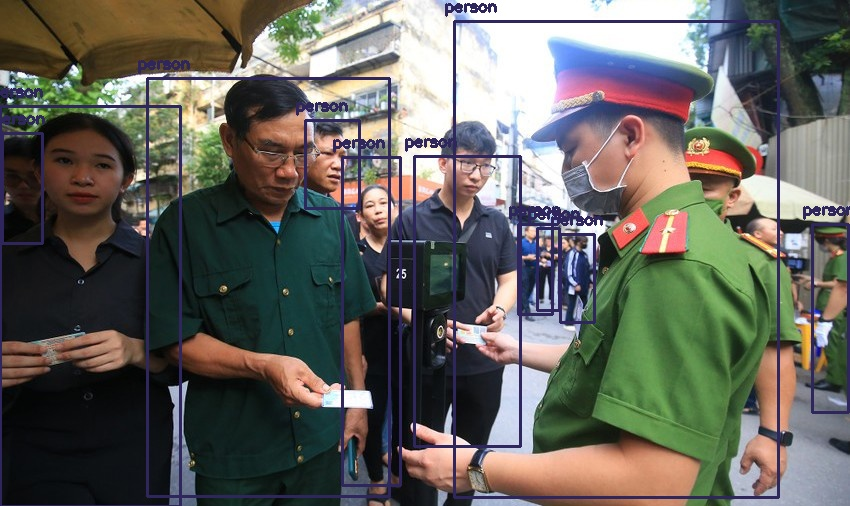
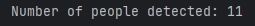

# Human Object Detection Using OpenCV and YOLO

 ## Dependencies

  * opencv
  * numpy
  
`pip install numpy opencv-python`

## Edit the configuration file

Edit the `yolov8.cfg` file to update the configuration parameters.

Edit the 'yolov8.weights' file to update the weights.

Edit the 'yolov8.txt' file to update the class labels.

Edit the 'path to image' in the code to update the image path.

## Run the code

Run the code using the following command:

`python main.py`

## Sample output

## References

* [YOLO: Real-Time Object Detection](https://pjreddie.com/darknet/yolo/)
* [OpenCV](https://opencv.org/)
